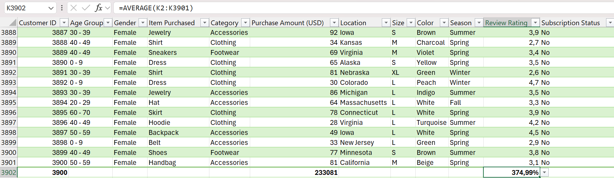

# trendora-project-analysis

## Business Context
Tendora is a growing fashion brand with customers both online and in-store. Management seeks help in understanding the business performance.

## Objective of The Analysis
This analysis used excel to transform raw data into meaningful insights, that will enable the management to understand customer’s behaviours better, and to strategize more effectively and efficiently on measures and steps to be taken in order to boost Trendora’s overall business performance.

## Data Overview
The dataset includes information on items purchased, purchased amount, payment method, location and season etc.

## Key Findings
- Top purchased items are Jewelries, Blouses, and Pants.
- The top purchasing states include Montana, California, Idaho, Illinois & Alabama.
- Debit Cards and Cash are most preferred payment methods to Bank Transfer                  
- Highest sales revenues are generated during Fall season.

